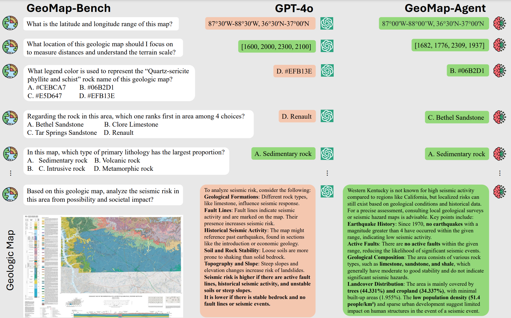
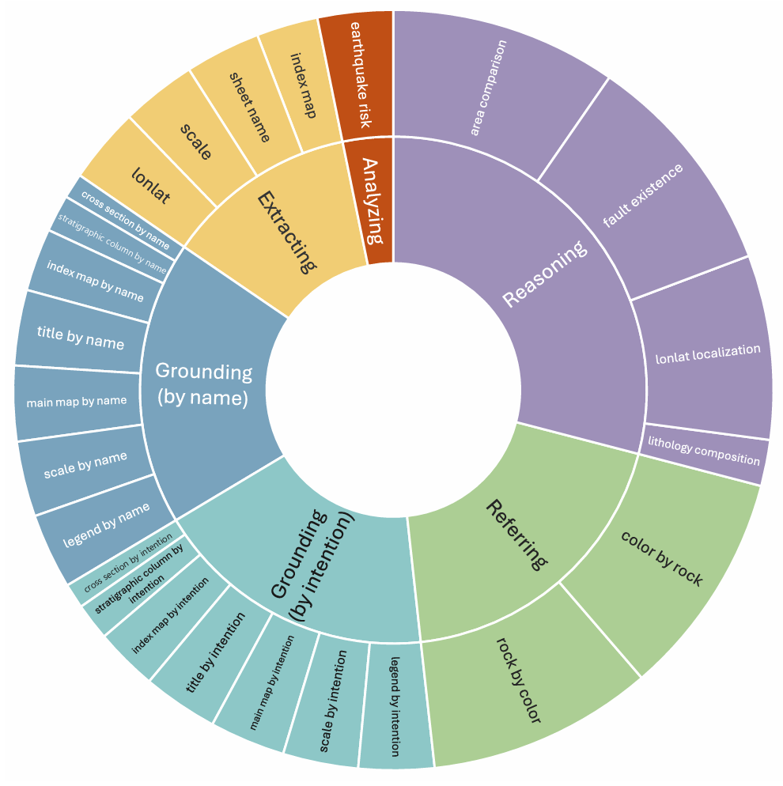
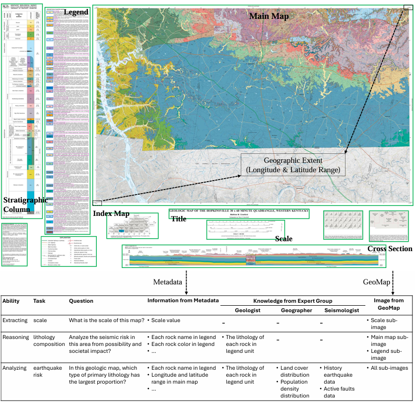

# PEACE: Em<a>p</a>owering G<a>e</a>ologic M<a>a</a>p Holisti<a>c</a> Und<a>e</a>rstanding with MLLMs
<!-- # PEACE: Em**p**owering G**e**ologic M**a**p Holisti**c** Und**e**rstanding with MLLMs -->

<div align="center">


</div>

<p align="center">
  <a href="https://arxiv.org/abs/"><b>[📜 Paper]</b></a> •
  <a href="https://huggingface.co/datasets/microsoft/PEACE"><b>[🤗 HF Dataset]</b></a> •
  <a href="https://github.com/microsoft/PEACE"><b>[🐱 GitHub Code]</b></a>
</p>

<p align="center">
    
</p>

## 📢 News and Updates
- 2024/12/5: 🔥GitHub Code repo (GeoMap-Agent) released.
- 2024/12/5: 🔥HuggingFace Dataset repo (GeoMap-Bench) released.
- 2024/12/5: 🔥Arxiv paper (PEACE) released.
## 📖 Table of Contents

- [Introduction](#-introduction)
- [GeoMap-Bench](#-geomap-bench)
- [GeoMap-Agent](#-geomap-agent)
- [Leaderboard](#-leaderboard)
- [Data Display](#-data-display)
- [Quickstart](#-quick-start)
- [Disclaimer](#-disclaimer)
- [Citation](#-citation)

## 🌟 Introduction
Geologic map, as a fundamental diagram in geology science, provides critical insights into the structure and composition of Earth's subsurface and surface. These maps are indispensable in various fields, including disaster detection, resource exploration, and civil engineering.

## 📖 GeoMap-Bench
We present **GeoMap-Bench**, a new benchmark consisting of 124 geologic maps and 3,864 multimodal multiple-choice questions with diverse annotations. The distribution of questions in the GeoMap-Bench. It consists of 25 task types that measure critical geological map interpretation abilities across **five** aspects: *grounding, extracting, referring, reasoning, and analyzing*.

<p align="center">
    
</p>

## 🌍 GeoMap-Agent
We introduce **GeoMap-Agent**, the inaugural agent designed for geologic map understanding, which features three modules: Hierarchical Information Extraction(HIE), Domain Knowledge Injection (DKI), and Prompt-enhanced Question Answering (PEQA). Inspired by the interdisciplinary collaboration among human scientists, an AI expert group acts as consultants, utilizing a diverse tool pool to comprehensively analyze questions.

<p align="center">
    
</p>

## 🧮 Leaderboard
Through comprehensive experiments, GeoMap-Agent achieves an overall score of 0.811 on GeoMap-Bench, significantly outperforming 0.369 of GPT-4o.

| Method               | Extracting | Grounding | Referring | Reasoning | Analyzing | Overall |
|----------------------|------------|-----------|-----------|-----------|-----------|---------|
| Random               | 0          | 0         | 0.250     | 0.250     | 0         | 0.100   |
| GPT-4o               | 0.219      | 0.128     | 0.378     | 0.507     | 0.612     | 0.369   |
| GeoMap-Agent         | 0.832      | 0.920     | 0.886     | 0.588     | 0.831     | 0.811   |

## 🔍 Data Display
We visualize the components of a typical geologic map, highlighting the complex nature of *cartographic generalization*. Additionally, we showcase sample questions from GeoMap-Bench and demonstrate how our GeoMap-Agent integrates various sources of contextual information to address them.
<p align="center">
    
</p>

## ⏩ Quick Start
<details open>
<summary>Installation</summary>

 - Step1: Clone GeoMap-Agent code repository
```
git clone https://github.com/microsoft/PEACE.git
cd PEACE
```

 - Step2: Clone GeoMap-Bench dataset repository
```
git lfs install
git clone https://huggingface.co/datasets/microsoft/PEACE data
```

 - Step3: Download layout detection [models](https://1drv.ms/u/s!AgRA5UKLXIyuiWIc-B8QJ0zj7xhx?e=gI1OL7)
```
wget -O models.zip https://ypocha.bn.files.1drv.com/y4mPknOtUu-Jnyfbrz2fsEL4mfJlOap3BrXsdouC8abut-97iVHuJfKKp1OOmOCed9qdamO7R2Ww_ZDfa5MpF2tYTlfwbLBYYIyjVHSlk8LQ5UL_QFJDPc_i-4_tWw5hvBXZ65ORwabWAXmT1UnLMukMazjaDXoqV3WHGwcWt96eicJliG_3TmxWn_dqCbIApxzoFtmMZG03KKYzmARXVaUcQ
unzip models.zip -d dependencies
```

 - Step4: Install dependencies
```
pip install -r requirements.txt
```

 - Step5: Configure LLMs API endpoint and key in utils/api.py

</details>

<details open>
<summary>Evaluation</summary>

```
python eval.py --copilot_mode HIE,DKI,PEQA --dataset_source usgs
```

</details>

## ⚡ Disclaimer
Due to the inherent limitations of large language models, issues such as hallucinations may occur.


## 🔗 Citation
```
TBD
```

## License
This repository is licensed under the [MIT](https://github.com/microsoft/PEACE/blob/main/LICENSE) License.
The use of Ultralytics library is subject to the [AGPL-3.0](https://github.com/ultralytics/ultralytics/blob/main/LICENSE) License.


[def]: #quick-start
