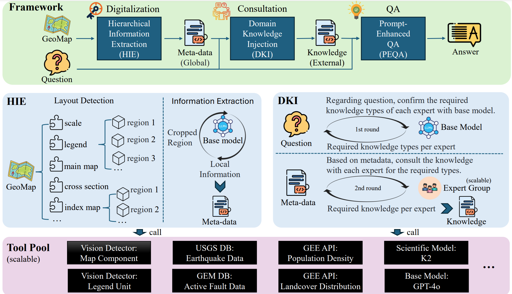
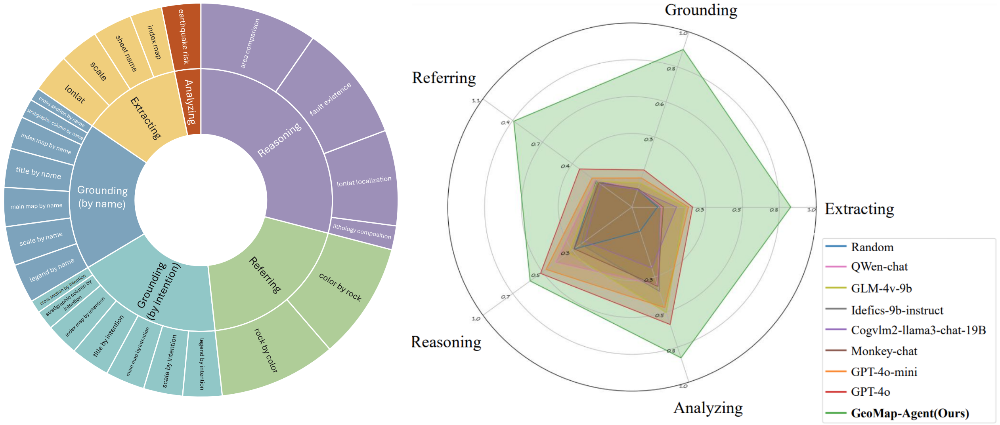

# PEACE: Em**p**owering G**e**ologic M**a**p Holisti**c** Und**e**rstanding with MLLMs

<div align="center">


</div>

<p align="center">
  <a href="https://arxiv.org/abs/"><b>[📜 Paper]</b></a> •
  <a href="https://huggingface.co/microsoft/GeoMap-Bench"><b>[🤗 HF Dataset]</b></a> •
  <a href="https://github.com/microsoft/PEACE"><b>[🐱 GitHub Code]</b></a>
</p>

<p align="center">
    
</p>

## Introduction
Geologic map, as a fundamental diagram in geology science, provides critical insights into the structure and composition of Earth's subsurface and surface. These maps are indispensable in various fields, including disaster detection, resource exploration, and civil engineering.

Despite their significance, current Multimodal Large Language Models (MLLMs) often fall short in geologic map understanding.
To bridge this gap, we introduce GeoMap-Agent, the inaugural agent designed for geologic map understanding, which features three modules: Hierarchical Information Extraction (HIE), Domain Knowledge Injection (DKI), and Prompt-enhanced Question Answering (PEQA).

### GeoMap-Agent

<p align="center">
    
</p>

### GeoMap-Bench

<p align="center">
    
</p>


## Quick Start
<details close>
<summary>Installation</summary>

 - Step1: Clone repository
```
git clone https://github.com/microsoft/PEACE.git
```

 - Step2: Download layout detection [models](https://github.com/microsoft/PEACE/releases/download/layout_model/models.zip)
```
wget https://github.com/microsoft/PEACE/releases/download/layout_model/models.zip
unzip models.zip
```

 - Step3: Install dependencies
```
pip install -r requirements.txt
```

 - Step4: Configure API endpoint and key in utils/api.py

</details>

<details open>
<summary>Evaluation</summary>

```
python eval.py --copilot_mode HIE,DKI,PEQA --dataset_source usgs
```

</details>

## Citation
```
TBD
```

## License
This repository is licensed under the [MIT](https://github.com/microsoft/PEACE/blob/main/LICENSE) License.
The use of Ultralytics library is subject to the [AGPL-3.0](https://github.com/ultralytics/ultralytics/blob/main/LICENSE) License.
